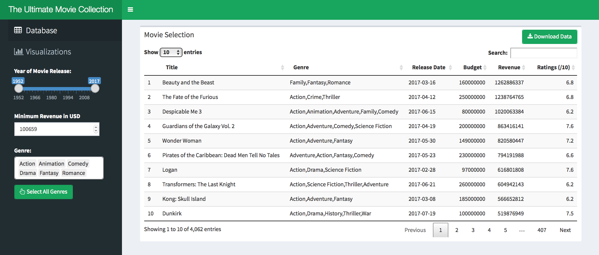
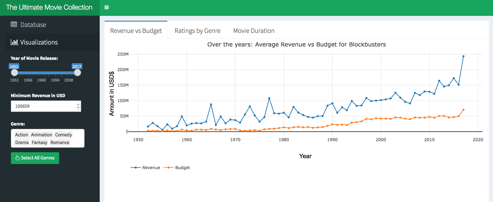

# Homework 2: Blockbuster Movies Visualization

By: Min Yan BEH (mbeh)

Deployed on [shinyapps.io](https://mbeh.shinyapps.io/hw-2/)

### Screenshots

### Data Source

The dataset was extracted from `movies_metadata.csv` on [Kaggle's "The Movie Dataset"](https://www.kaggle.com/rounakbanik/the-movies-dataset), which was curated by MovieLens. [MovieLens](https://movielens.org) is a non-commercial site that provides movie recommendations for free.

For the purpose of this application, I've only used a subset of this dataset (reduced size from 34MB to 2MB) to include high-grossing movies produced in English, and only movies from 1952 onwards. Details on the cleaning pipeline have been documented in the `data/movielens-cleaning-pipeline.ipynb` file.